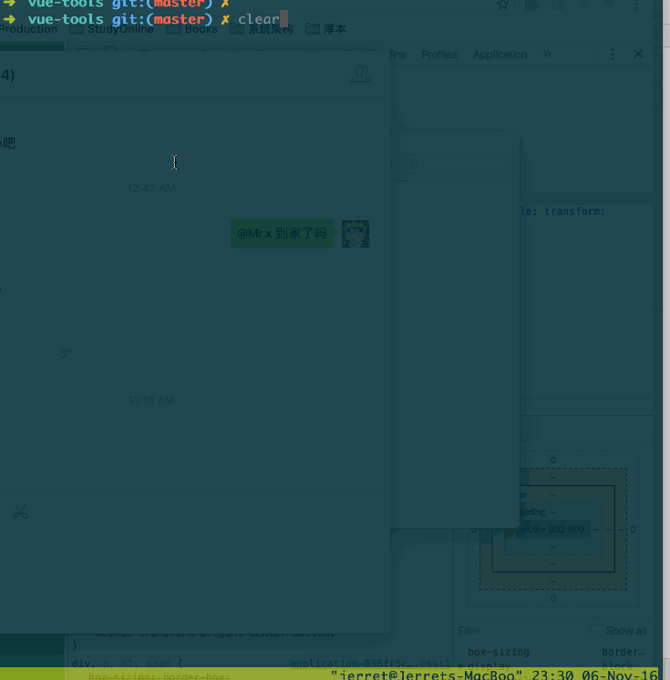

# Vue-tools

# use cli for dev soon

```
./bin/cli -l  // list all developed
./bin/cli component alert // create alert component
./bin/cli plugin alert // create alert plugin
./bin/cli directive alert // create alert directive
```
